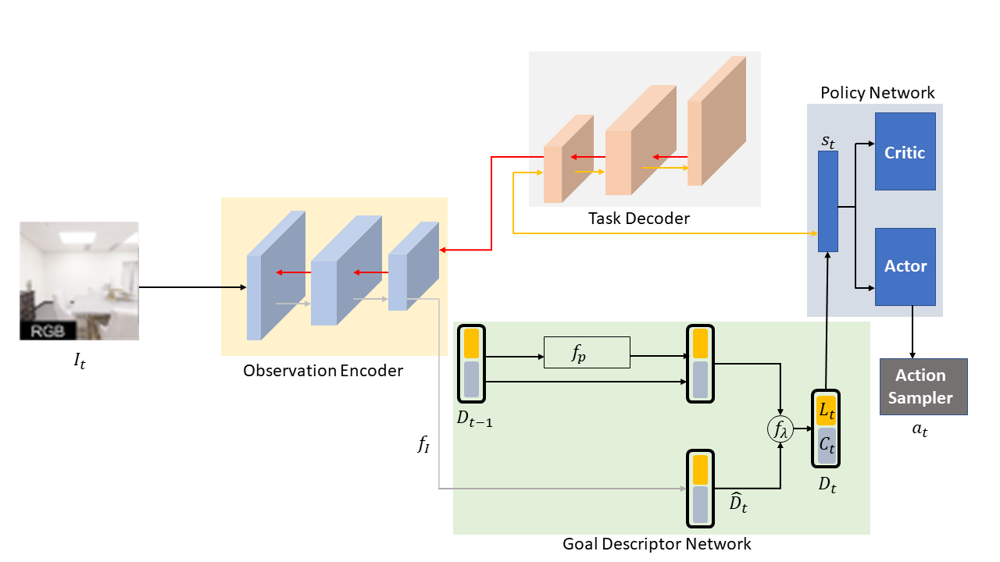
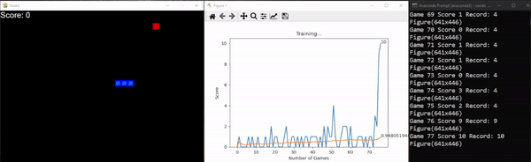
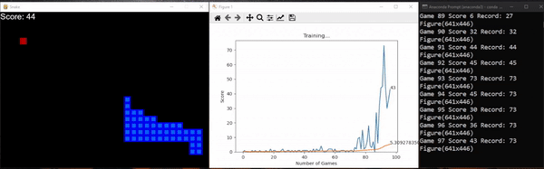
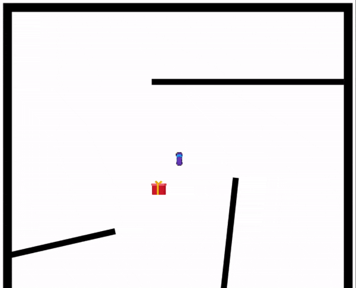
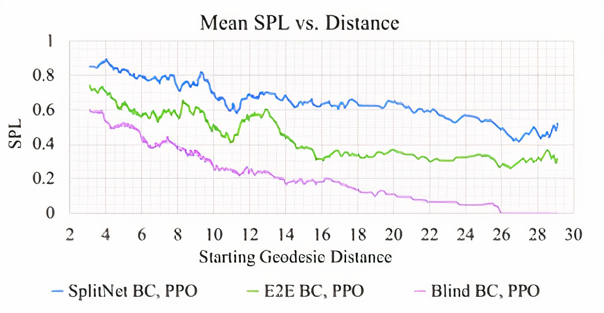

<div id="top"></div>

# DRLEVN: Deep Reinforcement Learning Embodied Visual Navigation
By [Sudharsan Ananth](https://sudharsanananth.wixsite.com/sudharsan), [Taiyi Pan](https://www.linkedin.com/in/taiyipan/), [Pratyaksh Prabhav Rao](https://praopratyaksh1.wixsite.com/pratyaksh10),

New York University

<!-- TABLE OF CONTENTS -->
<details>
  <summary>Table of Contents</summary>
  <ol>
    <li><a href="#introduction">Introduction</a></li>
    <li><a href="#dependencies">Dependencies</a></li>
    <li><a href="#experiments in 2d environment">Experiments in 2d Environment</a></li>
        <ul>
            <li><a href="#the snake game with Navigation RL Agent">The snake game with Navigation RL Agent</a></li>
            <li><a href="#the Car indoor agent with RL Agent">The Car indoor agent with RL Agent</a></li>
        </ul>
    <li><a href="#prerequisites">Prerequisites</a></li>
    <li><a href="#step-by-Step Installation">Step-by-Step Installation</a></li>
      <ul>       
          <li><a href="#Install Anaconda and pip">Install Anaconda</a></li>
          <li><a href="#Create conda environment">Create conda environment</a></li>
          <li><a href="#Install basic packages in environment">Install basic packages in environment</a></li>
          <li><a href="#Install Habitat-sim and test">Install Habitat-sim and test</a></li>
          <li><a href="#Install Habitat Lab and Test">Install Habitat Lab and Test</a></li>
          <li><a href="#Clone SplitNet repo">Clone SplitNet repo</a></li>
          <li><a href="#Run Test">Run Test</a></li>
      </ul>
    </li>
    <li><a href="#experiments">Experiments</a></li>
    <li><a href="#results">Results</a></li>
    <li><a href="#references">References</a></li>
    <li><a href="#license">License</a></li>
    <li><a href="#acknowledgments">Acknowledgments</a></li>
  </ol>
</details>


<!-- ABOUT THE PROJECT -->
## Introduction
<!--

-->
A longstanding goal of computer vision is to enable robots to understand their surroundings, navigate efficiently and safely, and perform a large variety of tasks in complex environments. It serves many applications in service robotics, search and rescues robots, etc. The agent must be able to perceive, map, plan, explore, and reason. Recent advancements in deep learning has empowered agents to accomplish embodied navigation tasks.

However, it is extremely challenging to achieve state-of-the-art performance. Some of the challenges include are
* perceiving partially observed input.
* exploring unseen environment.
* modeling seen scenarios.
* generalization.
* adapting to dynamic environment.

The main goal of the embodied navigation task is to allow an agent to find a target location by perceiving embodied visual inputs. In this project, we hope to tackle some of the challenges discussed above using an end-to-end deep reinforcement learning framework. Our framework will include feature extraction for understanding the perceived visual cue and a reinforcement learning policy for taking necessary actions. Our proposed framework allows for the sharing and reuse of information between different visual environments. Rather than learning the task of visual perception and policy learning independently or completely tied, we build on the work of Kim et al.  for learning these embodied visual tasks which benefits both from the scalability and strong in-domain, on-task performance of an end-to-end system and from the generalization and fast adaptability of modular systems.



This Project showed interesting results and we think would help community understand Reinforcement learning models better. This research is built on top of Facebook: SplitNet model architecture. 

This research will lead the way into cutting edge visual reinforcement learning agents for the problem of navigation of indoor robots. For easy visual understanding of this project, please navigate to tiny experiments section and follow the section to recreate a agent training to navigate using reinforcement learning.  

Use the `README.md` to get started.

<p align="right">(<a href="#top">back to top</a>)</p>


## Dependencies

This project is built with the below given major frameworks and libraries. Some of the libraries and tools support are supported only for Linux and Mac OS. The code is primarily based on python. And the environment is created using Anaconda. All the program is tested in Ubuntu 20.04 LTS with python version 3.7.11 and cmake version 3.14.0. Some of the libraries used are habitat, pytorch, matplotlib, opencv and many libraries are found in `requirements.txt`.

* [Python](https://www.python.org/)
* [Anaconda](https://www.anaconda.com/)
* [cmake](https://cmake.org/)
* [Habitat](https://aihabitat.org/)
* [pytorch](https://pytorch.org/)
* [opencv](https://opencv.org/)
* [matplotlib](https://matplotlib.org/)

<p align="right">(<a href="#top">back to top</a>)</p>

#### [<b>Habitat Sim</b>](https://github.com/facebookresearch/habitat-sim)
A high-performance physics-enabled 3D simulator with support for:
- 3D scans of indoor/outdoor spaces (with built-in support for [HM3D](https://aihabitat.org/datasets/hm3d/), [MatterPort3D](https://niessner.github.io/Matterport/), [Gibson](http://gibsonenv.stanford.edu/database/), [Replica](https://github.com/facebookresearch/Replica-Dataset), and other datasets)
- CAD models of spaces and piecewise-rigid objects (e.g. [ReplicaCAD](https://aihabitat.org/datasets/replica_cad/), [YCB](https://www.ycbbenchmarks.com/), [Google Scanned Objects](https://app.ignitionrobotics.org/GoogleResearch/fuel/collections/Google%20Scanned%20Objects)),
- Configurable sensors (RGB-D cameras, egomotion sensing)
- Robots described via URDF (mobile manipulators like [Fetch](http://docs.fetchrobotics.com/), fixed-base arms like [Franka](https://www.franka.de/),quadrupeds like [AlienGo](https://www.unitree.com/products/aliengo/)),
- Rigid-body mechanics (via [Bullet](https://github.com/bulletphysics/bullet3)).

The design philosophy of Habitat is to prioritize simulation speed over the breadth of simulation capabilities. When rendering a scene from the Matterport3D dataset, Habitat-Sim achieves several thousand frames per second (FPS) running single-threaded and reaches over 10,000 FPS multi-process on a single GPU. Habitat-Sim simulates a Fetch robot interacting in ReplicaCAD scenes at over 8,000 steps per second (SPS), where each ‘step’ involves rendering 1 RGBD observation (128×128 pixels) and rigid-body dynamics for 1/30sec.


Habitat-Sim is typically used with
[Habitat-Lab](https://github.com/facebookresearch/habitat-lab), a modular high-level library for end-to-end experiments in embodied AI -- defining embodied AI tasks (e.g. navigation, instruction following, question answering), training agents (via imitation or reinforcement learning, or no learning at all as in classical SensePlanAct pipelines), and benchmarking their performance on the defined tasks using standard metrics.

[](https://colab.research.google.com/github/facebookresearch/habitat-sim/)

[](https://aihabitat.org/demo)

https://user-images.githubusercontent.com/2941091/126080914-36dc8045-01d4-4a68-8c2e-74d0bca1b9b8.mp4

<p align="right">(<a href="#top">back to top</a>)</p>


#### [<b>Habitat Lab</b>](https://github.com/facebookresearch/habitat-lab)
Habitat Lab is a modular high-level library for end-to-end development in embodied AI –
defining embodied AI tasks (e.g. navigation, instruction following, question answering), configuring embodied agents (physical form, sensors, capabilities), training these agents (via imitation or reinforcement learning, or no learning at all as in classical SLAM), and benchmarking their performance on the defined tasks using standard metrics.

Habitat Lab currently uses [`Habitat-Sim`](https://github.com/facebookresearch/habitat-sim) as the core simulator, but is designed with a modular abstraction for the simulator backend to maintain compatibility over multiple simulators. For documentation refer [here](https://aihabitat.org/docs/habitat-lab/).

We also have a dev slack channel, please follow this [link](https://join.slack.com/t/ai-habitat/shared_invite/enQtNjY1MzM1NDE4MTk2LTZhMzdmYWMwODZlNjg5MjZiZjExOTBjOTg5MmRiZTVhOWQyNzk0OTMyN2E1ZTEzZTNjMWM0MjBkN2VhMjQxMDI) to get added to the channel. If you want to contribute PRs or face issues with habitat please reach out to us either through github issues or slack channel.

[](https://aihabitat.org/demo)
<p align="center">
  
</p>


<p align="right">(<a href="#top">back to top</a>)</p>

## <b><u>Experiments in 2d Environment</u></b>

The project started with a reinforcement learning snake game, and then a 2D agent navigating in a indoor map was created as a starting ground for out project. Both environment was developed in pygame, the agents use Deep-Q-Learning to train and navigate. This can be easily recreated by following the steps below. The snake agent takes around 1 hour to completely train and by using a deeper and much complex model it can navigate better. But to make this section easily reproduceble a faster and much efficient model is used. The car agent which is much complex uses a deeper model and has few glitches, this repo will be continously updated to fix issues since this is a on going research. Also note that this experiments run in Windows, Mac and Ubuntu.

## The snake game with Navigation RL Agent

<!--  Add Gif of Snake game-->



This game is the starting point from which the project was developed, this gives a easy representation of the problem we are solving. This part of the code is easy to recreate and gives result real time, since we will be working on a much smaller model and simpler environment. You will be able to see the agent training and getting better in minuites. 

### Reproduce this section


Simply clone the repo cd into the right directory and run agent using the below commands. Step-by-Step instructions given below

1. Clone the repository using 
   ```sh
   git clone https://github.com/taiyipan/drlevn
   ```

2. cd into the directory rl_snake_game 
   ```sh
   cd rl_snake_game
   ```

3. Recommended: create a conda environment 
    ```sh
    # We require python>=3.7 and cmake>=3.10
    conda create -n rl_visual_agents python=3.7 numpy matplotlib
    conda activate rl_visual_agents
    ```

4. Install opencv-python version 4.5.5
   ```sh
   conda install -c conda-forge opencv
   ```

5. Install opencv-python version 2.1.2
   ```sh
   conda install -c cogsci pygame
   ```

6. Install pyTorch (CPU verison). Please refer pytorch website to get right version for GPU. 
    ```sh
    # https://pytorch.org/get-started/locally/
    conda install pytorch torchvision torchaudio cpuonly -c pytorch
    ```

7. Run `agent.py` from this directory and from inside this environment
   ```sh 
   python agent.py
   ```

8. To run the environment without Reinforcement Agent and the agent controllable by WASD keys
    ```sh 
    python snake_game.py
    ```

## The Car indoor agent with RL Agent
<!-- Add Gif of Car game-->

This game gives much better understanding of how complex the project becomes as soon as we start adding elements. This agent is why we pivoted to habitat sim, and their tools for futer continuation of the project. In this environment the agent can see only a small section around the agent. The agent will learn and remember the environment. Note this is still a Experimental Version and might not run with certain hardware and configurations. 

### Reproduce this section(agent)

Simply clone the repo cd into the right directory and run agent using the below commands. Step-by-Step instructions given below. Most of the steps are similar to the previous agent above, simply change the directory and run `agent.py` from the directory `RL_car_game`. Skip step 1 and 3 if the previous snake agent was reproduced. 

1. Clone the repository using 
   ```sh
   git clone https://github.com/taiyipan/drlevn
   ```

2. cd into the directory rl_snake_game 
   ```sh
   cd RL_car_game
   ```

3. Recommended: create a conda environment 
    ```sh
    # We require python>=3.7 and cmake>=3.10
    conda create -n rl_visual_agents python=3.7 numpy matplotlib
    conda activate rl_visual_agents
    ```

4. Install opencv-python version 4.5.5
   ```sh
   conda install -c conda-forge opencv
   ```

5. Install opencv-python version 2.1.2
   ```sh
   conda install -c cogsci pygame
   ```

6. Install pyTorch (CPU verison). Please refer pytorch website to get right version for GPU. 
    ```sh
    # https://pytorch.org/get-started/locally/
    conda install pytorch torchvision torchaudio cpuonly -c pytorch
    ```

7. Run `agent.py` from this directory and from inside this environment
   ```sh 
   python agent.py
   ```

8. To run the environment without Reinforcement Agent and the agent controllable by WASD keys
    ```sh 
    python baseline_game.py
    ```


<!-- Prerequisites -->
## Prerequisites

This project is not supported in windows. Habitat sim is not available for Windows and is available only on Mac OS and Linux. The procedure for running this experiment in Mac OS is slightly different but the steps are the same. The link for Habitat-sim is given below along with the supported OS.
* [aihabitat](https://anaconda.org/aihabitat/habitat-sim)

Also please note that these results cannot be performed in a virtual machine. The dependencies and the path conflicts and will not work in a virtual machine with any verison of Ubuntu or Linux distributions. 

## To reproduce the Experiment in Super Computer (NYU HPC)

To reproduce the experiment and to facilitate faster training the use of super computer cluster with good graphics card is required. We have trained our model in NYU's HPC (High Performance Computing) platform. follow the PDF instructions given below to run experiments remotely in a super computer cluster. 

[HPC Instructions PDF](/assets/HPC_instructions.pdf)

## Step-by-Step Installation (for native Ubuntu 20.04LTS)

To reproduce the results and to run the experiment follow the instructions in this section. 

### 1. Install Anaconda

1. Update Local Package Manager 
   ```sh
   sudo apt-get update
   ```
2. If your system doesn’t have `curl`, install it by entering:
   ```sh
   sudo apt-get install curl
   ```
3. Retrieving the Latest Version of Anaconda. Copy paste the below link in a web browser and right click the download button and copy the url
   ```sh
   https://www.anaconda.com/distribution/
   ```
4. Create a Temporary Directory, and download anaconda using curl. make sure to change the url to the one copied from the above step
   ```
   mkdir tmp
   cd /tmp
   curl –O https://repo.anaconda.com/archive/Anaconda3-2020.02-Linux-x86_64.sh
   ```

5. Running the Anaconda Script. Press yes, accept the terms and aggrements and install anaconda after pasting the below line. 
   ```
   bash Anaconda3-2019.03-Linux-x86_64.sh
   ```
   
6. Activating Installation
   ```sh
   source ~/.bashrc
   ```

7. Install Pip
   ```sh
   sudo apt install python3-pip
   ```

8. Install Git
    ```sh
    sudo apt install git
    ```

### 2. Create conda environment

9. Preparing Conda Environment
    ```sh
    # We require python>=3.7 and cmake>=3.10
    conda create -n habitat python=3.7 cmake=3.14.0
    conda activate habitat
    ```
10. Installing basic package managers for easy installation. 
    ```sh
    # We need Git and pip to install requirments. Ensure to install inside the environment. 
    sudo apt install python3-pip
    sudo apt install git
    ```

11. Create a Directory for all the dependencies and libraries. 
    ```sh
    cd ~
    mkdir drlevn_prj
    cd drlevn_prj
    ```

### 3. Insalling Habitat-sim

11. To install habitat-sim with bullet physics (Needed). Should be inside the Environment.
    ```sh
    conda install habitat-sim withbullet -c conda-forge -c aihabitat
    ```
12. To check if the installation of habitat was successful
    ```sh
    python
    > import habitat
    ```
13. Clone the Habitat-sim from the GitHub
    ```sh
    git clone https://github.com/facebookresearch/habitat-sim
    ```
14. Run `example.py` to check that everything is installed correctly.
    ```sh
    python habitat_sim/examples/examples.py
    ```

### 4. Installing Habitat-Lab

15. Clone a stable version from the github repository and install habitat-lab. And also install habitat_baselines along with all additional requirements using the command below.
    ```sh
    git clone --branch stable https://github.com/facebookresearch/habitat-lab.git
    cd habitat-lab
    pip install -r requirements.txt
    python setup.py develop --all # install habitat and habitat_baselines
    ```
16. Run the example script python `examples/example.py` which in the end should print out number of steps agent took inside an environment (eg: `Episode finished after 18 steps.`).
    ```sh
    python examples/example.py
    ```
### 5. Cloning and Installing SplitNet

17. Go back to the previous directory `drlevn_prj` by using `cd ..`
    ```sh
    cd ..
    ```
18. Clone the SplitNet
    ```sh
    git clone https://github.com/facebookresearch/splitnet.git
    cd splitnet
    ```
19. deactivate the environment and update the enviroment with configuration file `environment.yml`. This step will remove all the conflicts and update many libraries. This step might take several minutes. 
    ```sh
    conda deactivate
    conda env update -n habitat -f environment.yml
    conda activate habitat
    ```

### 6. Running SplitNet
  SplitNet Data. We use the data sources linked from the public habitat-api repository. You will need to individually download MP3D, and Gibson from their sources. habitat-sim and habitat-api share the links to the files. We additionally use the Point-Nav datasets from habitat-api, but we also provide a script for generating new datasets.

20. Create a symlink to where you downloaded the directory containing the `scene_datasets` asset files for each of the datasets. Call this folder `data`
    ```sh
    ln -s /path/to/habitat/data data
    ```
21. Copy/Move the downloaded datasets into the data folder.
     ```sh
     mv downloaded_data/* data
     ```
  Evaluation can be performed during training using the --eval-interavl flag, but you may also wish to evaluate an individual file on its own. eval_splitnet.sh makes this possible.

22. Edit the `DATASET`, `TASK`, and `LOG_LOCATION` in [eval_splitnet.sh](/splitnet/eval_splitnet.sh) and any other variables you wish.
    
23. By default, the code restores the most recently modified weights file in the checkpoints folder. If this is not the one you want to evaluate, you will have to edit [base_habitat_rl_runner.py](/splitnet/base_habitat_rl_runner) `restore` function to point to the proper file.
    
24. Run `sh eval_splitnet.sh`

### 7. Recreating New DRLEVN results (experimentation version)

24. Clone the repo inside(skip if all the above steps are followed)
    ```sh
    git clone https://github.com/taiyipan/drlevn.git
    ```
25. Follow steps to install habitat sim, habitat lab, and requirements.txt from above.

26. Clone the repo inside the `drlevn_prj` directory
    ```sh
    cd drlevn
    ```

27. Train the agent using `train_drlevn.py`
    ```sh
    python train_splitnet.py
    ```

<!--
To Reproduce the accuracy of TPSNet(model), run `test.py` and ensure the model is on the right folder. This script will normalise the images to right value.
   ```sh
   python3 test.py
   ```
-->
<p align="right">(<a href="#top">back to top</a>)</p>

## Methodology

Solving the embodied visual navigation problem requires different types of high-level understanding and reasoning based on the visual inputs. In order to learn robust representations and action policies, one may have to think beyond the end-to-end training paradigm. In this project, our main focus is on the Point-to-Point Navigation task. In the experiments, the action space is discretized - forward, and rotation (left and right). The Point-to-Point navigation task involves an agent which is directed to navigate towards a point via a constantly updating tuple of angle to goal, distance to goal. The navigation instance is successful if the agent ends the episode within a fixed radius of the goal.


<p align="right">(<a href="#top">back to top</a>)</p>

<!-- ROADMAP -->
## Experiment

The navigation task is decoupled into two parts - a) visual perception, where the agent must understand what it sees, and b) action policy, where the agent must take a decision from its perceived visual input. At each time instant $t$ the agent perceives an egocentric image $I_{t}$ from its environment and the goal is to output an action $a_{t}$ such that the distance to goal is minimized. The first step is to model a function $F$ to obtain a feature embedding from the image $I_{t}$ such that $\phi_{t} = F(I_{t})$. The next step is to decode these features into an action $a_{t} = G_{\phi_{t}}$. The training procedure is independent of each other and we optimize portions of the network with distinct objectives to produce representations which are highly semantically meaningful and transferable. Fig. 1 illustrates our proposed methodology. For visual encoding we model $F$ as a Transformer, since the temporal feature matching problem is analogous to the sequence-to-sequence problem that inspired its development, other than their use of positional embeddings to describe where words are in a sentence.  

<p align="right">(<a href="#top">back to top</a>)</p>

## Results

The proposed framework is validated by utilizing the Habitat scene renderer on scenes from the near photo-realistic 3D room datasets, Matterport 3D and Gibson.

Results indicate that the SplitNet framework outperforms all other baselines when validated for both the datasets (refer Table 1). It achieved a SPL of $0.72$ and a success rate of $0.84$ in the MP3D setup, and a SPL of $0.70$ and a success rate of $0.85$ in the Gibson environment.  It is not surprising to find that the SPL and success rate of the Random baseline are very low because the agent was unable to anticipate the position of the target and relies on chance.  The Blind Goal Follower baseline is better than Random, as the agent can anticipate the position of the target since it is provided with an update goal vector. The blind methods are not provided with visual inputs.

<table class="blueTable">
<thead>
<tr>
<th>Results</th>
<th colspan="2">MP3D</th>
<th colspan="2">Gibson</th>
</tr>
<tr>
<th>IDK what</th>
<th>SPL</th>
<th>Success</th>
<th>SPL</th>
<th>Success</th>
</tr>
</thead>
<tfoot>
<tr>

</tr>
</tfoot>
<tbody>
<tr>
<td>Random</td>
<td>0.011</td><td>0.016</td><td>0.046</td><td>0.028</td>
</tr>
<tr>
<td>Blind Goal Follower</td>
<td>0.199</td><td>0.203</td><td>0.155</td><td>0.158</td>
</tr>
<tr>
<td>E2E PPO</td>
<td>0.322</td><td>0.477</td><td>0.634</td><td>0.831</td>
</tr>
<tr>
<td>E2E BC, PPO</td>
<td>0.521</td><td>0.733</td><td>0.606</td><td>0.769</td>
</tr>
<tr>
<td><b>SplitNet + BC</b></td><b></b>
<td><b>0.45</b></td><td><b>0.73</b></td><td><b>0.44</b></td><td><b>0.66</b></td>
</tr>
<tr>
<td>SplitNet BC + PPO</td>
<td>0.72</td><td>0.84</td><td>0.70</td><td>0.85</td>
</tr>
</tbody>
</table>

The above table illustrates the performance on unseen environments and comparision of our method to the baseline method. While the performance of our proposed framework is considerably lower than that of the baseline, we hope to improve its performance in the next phase of the project.

To validate the performance of our framework, we utilize the Success Weighted by Path Length (SPL) metric proposed in [9] - 

$$
    SPL = \dfrac{1}{N} \displaystyle\sum_{i=1}^{N}S_{i}\dfrac{l_{i}}{max(p_{i}, l_{i})}
$$


where $S_{i}$ is a success indicator for episode $i$, $p_{i}$ is the path length, and $l_{i}$ is the shortest path length.



We analyze the performance of the baselines as a function of the geodesic distance between the starting location and the target position (refer Fig. 5). As illustrated in the figure, the distance is correlated with the complication of an episode. As expected, all baselines tend to degrade as the starting position is moved away from the target location. 

## References

This project is based on the paper `SplitNet: Sim2Sim and Task2Task Transfer for Embodied Visual Navigation`. Which was published on 18 May 2019. This paper shows a method for decoupling visual perception and policy learning. By incorporating auxiliary tasks and selective learning of portions of the model, we explicitly decompose the learning objectives for visual navigation into perceiving the world and acting on that perception.  Additionally, SplitNet generalizes better to unseen environments from the same simulator and transfers faster and more effectively to novel embodied navigation tasks. Further, given only a small sample from a target domain, SplitNet can match the performance of traditional end-to-end pipelines which receive the entire dataset.

You can find the paper here: [SplitNet: Sim2Sim and Task2Task Transfer for Embodied Visual Navigation](https://arxiv.org/abs/1905.07512)

<p align="right">(<a href="#top">back to top</a>)</p>

<!-- LICENSE -->
## License

Distributed under the MIT License. See `LICENSE.txt` for more information.

<p align="right">(<a href="#top">back to top</a>)</p>


<!-- CONTACT -->
## Contact

[Taiyi Pan]([taiyipan@gmail.com](https://www.linkedin.com/in/taiyipan/)) - taiyipan@gmail.com

[Pratyaksh Prabhav Rao]([pr2257@nyu.edu](https://sudharsanananth.wixsite.com/sudharsan)) - pr2257@nyu.edu


[Sudharsan Ananth]([sudharsan.ananth@gmail.com](https://sudharsanananth.wixsite.com/sudharsan)) - sudharsan.ananth@gmail.com


Project Link: [https://github.com/taiyipan/TPSNet](https://github.com/taiyipan/TPSNet)

<p align="right">(<a href="#top">back to top</a>)</p>


<!-- ACKNOWLEDGMENTS -->
## Acknowledgments

We would like to express our thanks to the people who's discussion helped us through the project. We are grateful to Prof. Siddharth Garg, Prof. Arsalan Mosenia and the teaching assistant Ezgi Ozyilkan for their nonstop support. Lastly, we would like to extend our special thanks to the  teaching team for giving us this opportunity to work on these assignments and projects. They were extremely helpful and pertinent to understanding the concepts.

[Siddharth Garg](https://engineering.nyu.edu/faculty/siddharth-garg?msclkid=47fb5f5dabed11ecbf387043e42d37ff)

[Arsalan Mosenia](http://www.arsalanmosenia.com/?msclkid=666ff071abed11ec93028e78876e48a0)

[Ezgi Ozyilkan](https://github.com/ezgimez?msclkid=7ab30b9dabed11ecbc97e757df7aeb95)

<p align="right">(<a href="#top">back to top</a>)</p>

